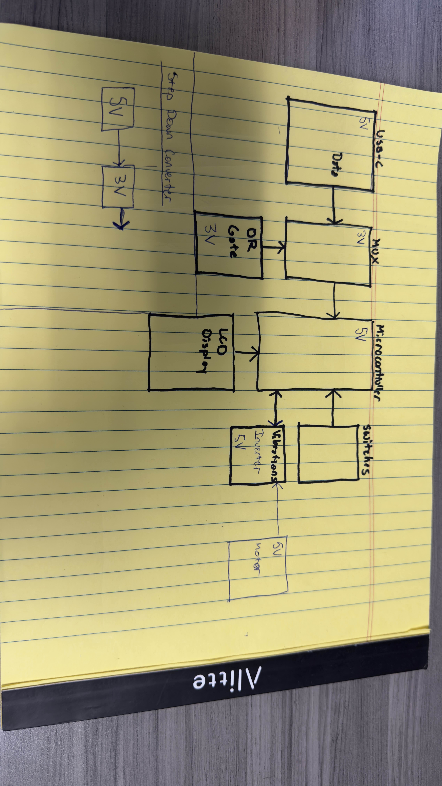
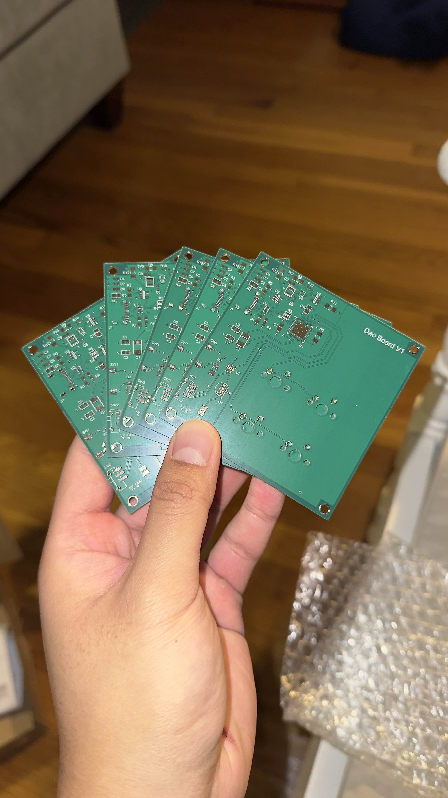
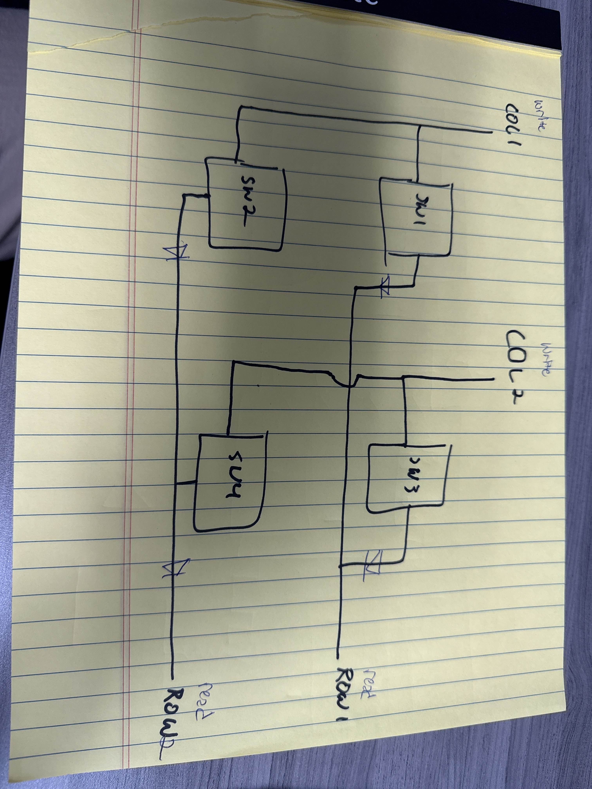
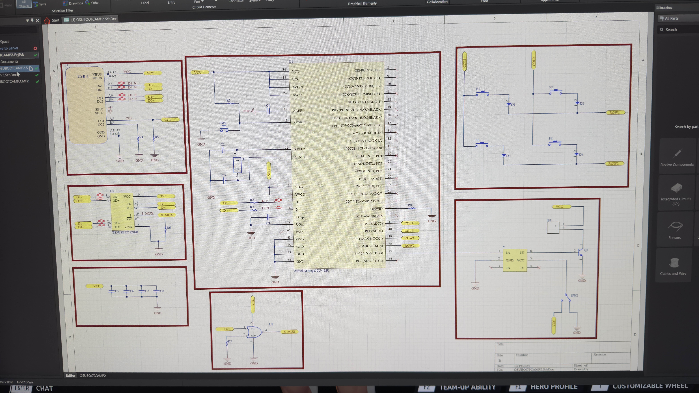

# daoboard

## Overview 

Daoboard is a custom PCB board which is designed to interface with four key switches.

## Hardware

- Microcontroller: ATmega32U4
- Pins used:
    - PFO
    - PF1
    - PF3
    - PF4

Diodes: Each switch includes a diode for anti-ghosting protection

PORTF is an 8 bit I/O Data Register that controls the logic output levels and pull-up configuration for the Port F pins.

## Firmware Behavior

### Phase 1

Output some text whether to the usb or a file indicating that a key switch has been pressed

## Programming

The firmware will be written in C using the *dfu-programmer*

```bash
sudo dfu-programmer atmega32u4 erase
sudo dfu-programmer atmega32u4 flash main.hex
sudo dfu-programmer atmega32u4 start
```
## Libraries/Tools
- Makefile
- dfu-programmer
- avr lib code


## Schematic 




